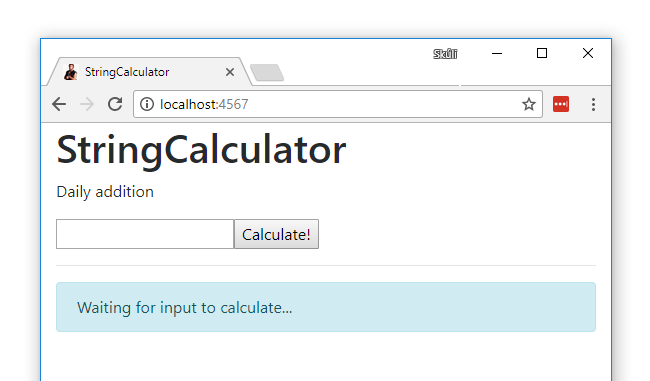

# CalcWeb
CalcWeb written in Java (Java8+), using
[TestNG](http://testng.org/doc/) as it's testing framework, and
[Gradle](https://gradle.org/) as it's build system.

Web running via [Spark](http://sparkjava.com/).

## Getting started
- Run tests: `gradle test` (`./gradlew test`)
- Run application: `gradle run` (`./gradlew run`)
  - This will run the Web on port 4567, unless a `PORT` system environmental
variable is set.
